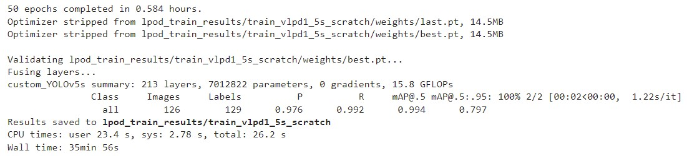
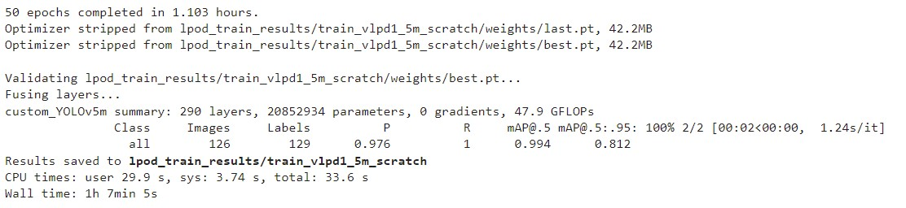

# License Plate Object Identification

## Introduction
This is a project with a purpose to produce a pipeline which can automatically identify and recognize license plate characters and numbers from an image obtained from video, surveillance cameras, etc. This project can be applied to all kind of thing involve license plate identification for vehicle payment system, tracking and finding cars, etc.

## Approach
There are 3 major steps approach in order to identify license plate characters and numbers, those are:
1. [License Plate Object Detection](#license-plate-object-detection)
2. [Character Segmentation](#character-segmentation)
3. [Character Recognition](#character-recognition)

## Dataset
We prepared 3 datasets for this project:
1. **License Plate Object Detection**: Collecting pictures of cars from the internet and on the streets of Jakarta. Then, annotate the region of interest (license plate) dataset for using tool from [Roboflow](https://roboflow.com/). Roboflow supports over [30 formats object detection formats](https://roboflow.com/formats) for conversion.for object detection training purposes.
2. **Character Segmentation**: Using same dataset for License Plate Object Detection from [Roboflow](https://roboflow.com/). The tool can select whether to export the picture of the data that has been annotated or the full image. For this part, the dataset will be the picture of the license plate only (region of interest).
3. **Character Recognition**: **NOT YET BEING FILLED** 

## Technologies/Languages Used
- **Python**: This is the most used language for implementing AI projects
- **IDE**: We used Jupyter Notebook () and Google Colab (for developer who suffer  low hardware capabilities) for this project.
- **OpenCV**: OpenCV is a library of programming functions mainly aimed at real-time computer vision. It eases the work when projects are based primarily on images or videos.
- **Tensorflow**: TensorFlow is a free and open-source software library for machine learning. It can be used across a range of tasks but has a particular focus on training and inference of deep neural networks.
- **Keras**: Keras is an open-source software library that provides a Python interface for artificial neural networks. Keras acts as an interface for the TensorFlow library.
- **YOLOv5 (by [Glenn Jocher](https://www.linkedin.com/in/glenn-jocher/))**: YOLOv5 is a is a real-time object detection algorithm that identifies specific objects in videos, live feeds, or images.
- **Pipenv**: Pipenv is a tool for creating Python environment a lot easier. It automatically creates and manages a virtualenv for your projects, as well as adds/removes packages from your *Pipfile* as you install/uninstall packages. It also generates the ever-important *Pipfile.lock*, which is used to produce deterministic builds.
- **PyTorch**: PyTorch is an open source machine learning framework based on the Torch library used for applications such as computer vision and natural language processing, primarily developed by [Meta AI](https://ai.facebook.com/). PyTorch is used a dependency to run YOLOv5 which was created using PyTorch.
- **TensorFlow.js**: TensorFlow.js is an open-source hardware-accelerated JavaScript library for training and deploying machine learning models.
- **TensorFlow.js converter**: TTensorFlow.js converter is an open source library to load a pretrained TensorFlow SavedModel or TensorFlow Hub module into the browser and run inference through TensorFlow.js.

## License Plate Object Detection
The architecture of the model consists of 3 main pieces which are:
1.	**Backbone:** The YOLOv5 models use a [Cross Stage Partial Networks](https://arxiv.org/abs/1911.11929) as the backbone to extract informative feature from the input image. 
2.	**Neck**: The YOLOv5 models use a [PANet](https://arxiv.org/abs/1803.01534) to get a feature pyramids which helps to generalize and identify object at various sizes and scales.
3.	**Head**: Consumes features from the neck and takes box and class prediction steps. It applies anchor boxes on features and and generates final output vectors with class probabilities, objectness scores, and bounding boxes.

The training from fine-tuning YOLOv5s model achieved  mAP_0.5 of **0.994** and mAP_0.5:0.95 of **0.797**.

    

The training from fine-tuning YOLOv5m model achieved  mAP_0.5 of **0.994** and mAP_0.5:0.95 of **0.812**.

    

Sadly, the author of YOLOv5 hasn't published an official paper about their research, all information about the YOLOv5 can be found in the [GitHub](https://github.com/ultralytics/yolov5) and official [blog posts](https://ultralytics.com/blog). The model will potentially be used is YOLOv5s version since its lightweight model with almost the same mAP as the YOLOv5m version.

## Character Segmentation
Models are divided to two main parts, which are:
1. Using **OpenCV** library to preprocess the RGB image into a binary image consist of *black* and *white* pixels. *black* as the background image and *white* as the detected characters. 
2. Filter the white pixels to determine whether it is a noise or a characters with **OpenCV** and give the Region of Interest of detected characters into Character Recoginition API. 

## Character Recognition

# Result
The website demo for the Machine Learning Service only are available by visiting this GitHub [link](https://github.com/marcellinus-witarsah/VePay-Go-ML-Demo)
